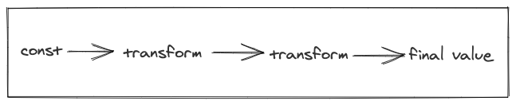
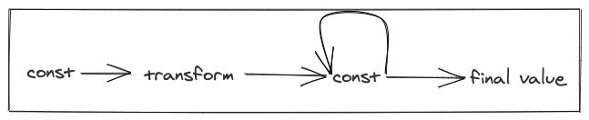
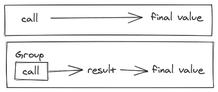
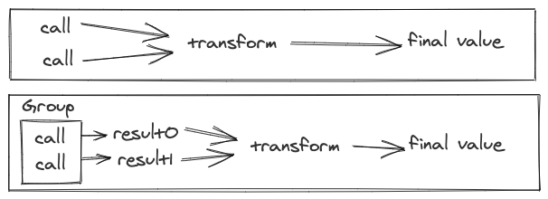

.. _basic-examples:

Basic Examples
##############

.. note::

  Be sure you have followed the instructions in :ref:`setup` for importing dependencies before running examples.

.. _const:

Const
*****

In the below example we will go over transforming data and composing Stitches together.

The most basic example of a Stitch is a `Stitch.const`, this is analogous to a `Future.const`.

We can use `Stitch.value` and `Stitch.exception` to make our intentions clear when using a `const`.
`Stitch.const`, `.value`, and `.exception` are by value so they aren't evaluated lazily.
The same applies to `Stitch.apply`, which is analogous to `Future.apply`,
in that it wraps a computation and returns a `Stitch` (instead of a `Future`),
`.apply` is evaluated eagerly as well.

.. code-block:: scala

  val s: Stitch[Int] = Stitch.value(0)
  val f: Future[Int] = Stitch.run(s)
  Await.result(f) // result: 0

.. image:: images/Const.png
  :alt: A graph showing a const becoming the final value

`Stitch.const`, `Stitch.value`, and `Stitch.exception` are slightly different compared to other
Stitches since :ref:`unlike other Stitches, these are safe to re-run <never-re-runnable>`.

.. _transformations-effects:

Transformations and Effects
***************************

By running the Stitch we get a Future that will complete when the Stitch is done.
In the above example the future will contain the value 0.
We can expand on the above example by composing some simple transformations
that you’re likely familiar with from Futures.

.. code-block:: scala

  val s = Stitch.value(0)
      .map(_ + 1)
      .flatMap(v => Stitch.value(v + 1))
      .onSuccess(v => println(s"It was successful! We got $v"))
  Await.result(Stitch.run(s)) // result: 2

.. image:: images/TransformTransformEffect.png
  :alt: A graph showing multiple transformations and a side effect

The above will yield a value of 2 and print "`It was successful! We got 2`".
The above was a straightforward transformation and side effect.
But since it's important to ensure that all parts of the Stitch you want to
run are included in the final Stitch, let's go over how to do this more generally.

.. code-block:: scala

  val s = Stitch.value(0)
      .map(_ + 1)
      .applyEffect(_ =>
        Stitch
          .sleep(Duration.fromSeconds(3))(new JavaTimer())
          .map(_ => println("this is a side effect")))
      .flatMap(v => Stitch.value(v + 1))

  // paste the below in separately due to an issue with the repl

  Await.result(Stitch.run(s)) // result: 2

.. image:: images/TransformSleep.png
  :alt: A graph showing multiple transformations and a sleep

In the above snippet we are utilizing `applyEffect` to let us run any
arbitrary Stitch as a side effect. This kind of composition is
important to ensure that side effects actually execute.
This is called out more later in the :ref:`lazy` section,
but to have the side effect run we need to ensure that these
side effects become part of the Stitch that is run. In this case,
the Stitch's completion is delayed until the side effect is completed.

When something is added as an effect, it is added to the query,
but that doesn’t make it asynchronous. A Stitch will normally complete
only after all parts of the execution graph are completed. However,
if you want to fire-and-forget then you can use `Stitch.async`.
An async Stitch is special in a few ways, if it fails, the original
Stitch won’t be impacted, and the Future returned by `Stitch.run` will
complete even if the async operation has not.

.. code-block:: scala

  val s = Stitch.value(0)
      .applyEffect(_ => Stitch.async(
          Stitch
            .sleep(Duration.fromSeconds(5))(new JavaTimer())
            .map(_ => println("this is an async side effect"))))
  Await.result(Stitch.run(s)) // result: 0, completes without waiting

.. image:: images/TransformAsyncSleep.png
  :alt: A graph showing multiple transformations and an async sleep

Even though the effect will sleep for 5 seconds before completing,
the returned Future will complete without waiting,
"this is an async side effect" will be printed after the returned
Future is already completed.

.. _join-collect-traverse:

Join, Collect, and Traverse
***************************

`join` lets you join Stitches together so they become part of the same query.
By joining Stitches together, operations can be batched across all the joined Stitches.

.. code-block:: scala

  val s = Stitch.join(Stitch.value(0), Stitch.value(1), Stitch.value(2))
  Await.result(Stitch.run(s)) // result: (0, 1, 2)

.. image:: images/Join4.png
  :alt: A graph showing 4 Stitches being joined together

Oftentimes you will want to query over a large number of input items,
however `join` is only useful for small tuples.
Stitch provides both `collect` and `traverse` functions to connect
large numbers of Stitch queries together.

`collect` lets you take a `Seq`, `Map`, or `Option` of Stitches
and run them together as part of the same query, similar to `join`.
By collecting all the Stitches together, calls across all the
Stitches can be batched together.

.. code-block:: scala

  val s = Stitch.collect(Seq(
    Stitch.value(0),
    Stitch.value(1),
    Stitch.value(2),
    Stitch.value(3)))
  Await.result(Stitch.run(s)) // result: Seq(0,1,2,3)

.. image:: images/Join4.png
  :alt: A graph showing 4 Stitches being collected together

With `traverse` you can define a function that will build a Stitch for each input.
With `collect` you need to have each query built up, but with `traverse`,
you only need the input necessary to generate the query.

.. code-block:: scala

  val s = Stitch.traverse(Seq(0,1,2,3)){v => Stitch.value(v).map(_ + 1)}
  Await.result(Stitch.run(s)) // result: Seq(1,2,3,4)

`traverse` is equivalent to a `collect` where you map over the input Seq to make each Stitch

.. code-block:: scala

  val s = Stitch.collect(
    Seq(0,1,2,3).map(v => Stitch.value(v).map(_ + 1)))
  Await.result(Stitch.run(s)) // result: Seq(1,2,3,4)

.. image:: images/Join4.png
  :alt: A graph showing 4 Stitches being traversed together

A common mistake is to have multiple independent `Stitch.run` calls by doing something like

.. code-block:: scala

  val requests: Seq[T]
  def mkStitch(t:T): Stitch[U]

  requests.map(r => Stitch.run(mkStitch(r))) : Seq[Future[U]]

This could be rewritten as `Stitch.run(Stitch.traverse(requests)(mkStitch)) : Future[Seq[U]]`
to take full advantage of Stitch's batching across all the Stitches.

.. _refs:

Refs
****

:ref:`Each Stitch must only ever be run once <never-re-Runnable>`,
but parts of a Stitch can be reused elsewhere in the same Stitch.
When part of a Stitch is reused within the same Stitch,
it will be executed each time.

.. code-block:: scala

  val s0 =
    Stitch.Unit.onSuccess(_ => println("this will execute twice"))
  val s1 = s0.before(s0)
  Await.result(Stitch.run(s1))

This Stitch will run similar to this, with the transform (`onSuccess`) occurring again

.. image:: images/Reused.png
  :alt: A graph showing a Stitch where part of it is run again

We can flatten this to this simpler graph.

In the above example, "`this will execute twice`" prints out twice.
This differs from `Future` where once it's run the result is memoized so it's
only ever executed once. There will be times where this type of multiple
execution will be desired but there will also be occasions where it's not.
That's where `Stitch.ref` comes in.

.. code-block:: scala

  val s0 = Stitch.ref(
    Stitch.Unit.onSuccess(_ => println("this will execute once")))
  val s1 = s0.before(s0)
  Await.result(Stitch.run(s1))

With the `ref`, the result of the transform (`onSuccess`) essentially
becomes a `const` which is simply accessed for it's value instead of a
Stitch that gets executed.

With a `Stitch.ref`, once the ref has been run in one part of the Stitch,
when it's used again in another part of the Stitch, it will just get the
result and not execute again.

.. _callfuture:

CallFuture
**********

Futures can be composed within Stitches using `Stitch.callFuture`.
This lets you use code which works in terms of Futures within Stitch.

In this example we have a `mockServiceCall` which simulates making
a call to a service by sleeping then returning a result.

.. code-block:: scala

  implicit val timer: Timer = new JavaTimer()

  def mockServiceCall() = {
      Future.sleep(Duration.fromSeconds(1)).map(_ => 0)
  }

  val s = Stitch.callFuture(mockServiceCall())

  // paste the below in separately due to an issue with the repl

  Await.result(Stitch.run(s)) // result: 0, after a 1sec delay

.. image:: images/CallFuture.png
  :alt: A graph showing the execution of a CallFuture

Using `callFuture` can allow you to easily inter-operate with Futures, however
it can come at a cost and it can negatively impact downstream batching behavior.
In some cases it may be beneficial to utilize :ref:`groups` instead as they will
generally have better batching behavior for downstream calls.

.. _calls:

Calls
*****

The most fundamental operation in Stitch is an atomic query.
A Stitch atomic query is represented by a `call`, which accepts a single key and returns a single value.
The key can be any type `K` and the value can be of any type `V` .
A Stitch call also requires a :ref:`group<Groups>` to handle the batching.

So far we have covered transformations and integration with Futures, however
none of these take advantage of the main benefit you get from using Stitch,
batching. This is where `Stitch.call` comes in. A `Stitch.call` accepts
a single key and returns a single value but behind the scenes it handles
batching for you.

Most services abstract away the actual `call` but not all do.
If they don’t or if you are writing a :ref:`Service Adapter <service-adapters>`
then you’ll need a `Group`. Groups aggregate calls during Stitch graph
simplification. The details of `Groups` are covered in :ref:`the Group section <groups>`,
but for now, think of these `Groups` as ways to call a service that adds 1 to an integer.

In the below example, we have a group `g`, this group simply adds 1 the argument passed into it.

.. code-block:: scala

  val g = new SeqGroup[Int, Int]{
  def run(keys: Seq[Int]): Future[Seq[Try[Int]]] =
    Future.value(keys.map(i => Return(i + 1)))
  }
  val s = Stitch.call(0, g)
  Await.result(Stitch.run(s)) // result: 1

A `Stitch.call` is just another type of Stitch and can be composed with other Stitches.

.. code-block:: scala

  val g = new SeqGroup[Int, Int]{
  def run(keys: Seq[Int]): Future[Seq[Try[Int]]] =
    Future.value(keys.map(i => Return(i + 1)))
  }
  val s = Stitch.join(
    Stitch.call(0, g),
    Stitch.call(1, g))
  Await.result(Stitch.run(s)) // result: (1,2)

With these 2 Stitch queries joined, when they are run, they get batched together.

Next :ref:`failure-Handling`
