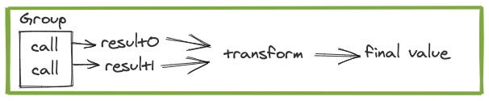

.. _groups:

Groups
######

.. note::

  Be sure you have followed the instructions in :ref:`setup` for importing dependencies before running examples.

Stitch Groups are the main APIs that customers will want to implement to make their
service's endpoints usable with Stitch. For most Stitch customers who are calling
services there will already be a Group for each batch endpoint provided by the
service owner.

`Groups` are used to batch and perform RPCs to other services.
There are 2 main classifications of `Groups`, Map and Seq.
Map groups are for APIs that return key-value mappings while Seq groups are for
APIs that return a Seq of results in the same order as the input.
For both of these Groups, :ref:`keys are de-duplicated by equality <deduplication-non-idempotent-calls>`.

Focusing on the existing Seq and Map groups, there are only a few things that need to be
configured in order to make a Group to take advantage of batch endpoints in a service.

`run` is an implementer-defined function from `Seq[Key]` to either
`Future[Seq[Try[Value]]]` or `Future[Key => Try[Value]]`.
This is generally just a call to a service’s batch endpoint.
Stitch manages the size and concurrency for you so the run function only
has to worry about making the actual RPC.

`maxSize` configures the max number of keys in a single RPC

`maxConcurrency` configures the max number of in-flight requests for each `Stitch.run`.

When a `Group` is used by Stitch, the Stitch :ref:`runners` ensures
that the `Seq[Key]` passed into the `Group.run` method is at most `maxSize`.
Stitch also ensures that there are at most `maxConcurrency` pending
Futures returned by `run`. In other words, run will be called only when the
`maxConcurrency` allows it to be called, and will be given a `Seq[Key]`
of the configured size.

Below are some examples of `Groups` with placeholder code for performing an RPC.
The first example is a `Group` that simply adds 1 to each input value,
this could be replaced with any Future returning code though,
such as a task scheduled with a timer.

.. code-block:: scala

  val g = new SeqGroup[Int, Int]{
  	override val maxSize = 10
  	override val maxConcurrency = 10
    override def run(keys: Seq[Int]): Future[Seq[Try[Int]]] = {
      // any code that takes in a Seq[Int]
      // and returns a Future[Seq[Try[Int]]
      Future.value(keys.map(i => Return(i + 1)))
  }}

  Await.result(Stitch.run(Stitch.call(0, g))) // result: 1

In the next example we've pulled out the `Future` code into `performNonBatchedRpc`
which would be similar to accessing an existing client with a non-batch API that returns a `Future`.
Even though this example endpoint isn't batched, it may still be beneficial to use a `Group` instead
of just utilizing `callFuture` because it can increase batching performance of later calls.
An example of timing differences resulting in different batching behaviors can be seen in
the second example in :ref:`the Ordering section <ordering>`.

.. code-block:: scala

  def performNonBatchedRpc(i: Int): Future[Try[Int]] = {
    Future.value(i + 1).liftToTry
  }

  val g = new SeqGroup[Int, Int]{
    override def run(keys: Seq[Int]): Future[Seq[Try[Int]]] = {
      Future.collect(keys.map(performNonBatchedRpc))
  }}

  Await.result(Stitch.run(Stitch.call(0, g))) // result: 1

The last example is the most typical type of `Group`. Typically a `Group` is used to ensure
batching to backends, so it will be used to make RPCs to batched endpoints. `performBatchedRpc`
would be similar to accessing an existing client with a batch API that returns a `Future`.

.. code-block:: scala

  def performBatchedRpc(s: Seq[Int]): Future[Seq[Try[Int]]] = {
    Future.value(s.map(i => Return(i + 1)))
  }

  val g = new SeqGroup[Int, Int]{
  override def run(keys: Seq[Int]): Future[Seq[Try[Int]]] = {
    performBatchedRpc(keys)
  }}

  Await.result(Stitch.run(Stitch.call(0, g))) // result: 1

We can do all the same things with a `MapGroup` as we can with a `SeqGroup` as well.

.. code-block:: scala

  def performBatchedRpc(s: Seq[Int]): Future[Int => Try[Int]] = {
    Future.value(s.zip(s.map(i => Return(i + 1))).toMap)
  }

  val g = new MapGroup[Int, Int]{
  override def run(keys: Seq[Int]): Future[Int => Try[Int]] = {
    performBatchedRpc(keys)
  }}

  Await.result(Stitch.run(Stitch.call(0, g))) // result: 1

When using `Groups`, you should use equal `Group` instances (e.g. the same
instance, or if the `Group` is a `case class` then it has the same input arguments)
for all calls to a given backend. This is part of why :ref:`service-adapters` often hide
the `Group`, since the implementer can ensure that the correct `Group` is used.
Stitch batches requests by aggregating all calls to a specific `Group`,
so in order to batch across calls, those calls must have equal `Groups`.
If you don’t, then no batching will occur.
This means doing something like this which will batch into a single RPC:

.. code-block:: scala

  val g: Group[Int, Int]
  Stitch.join(
    Stitch.call(0, g),
    Stitch.call(1, g))

.. code-block:: scala

  Stitch.join(
    Stitch.call(0, new Group{}),
    Stitch.call(1, new Group{}))

but doing something like this **won’t** batch:

.. image:: images/GroupsDifferentInstance.png
  :alt: Graph showing no batching when using incorrect Group instances

Next :ref:`service-adapters`
