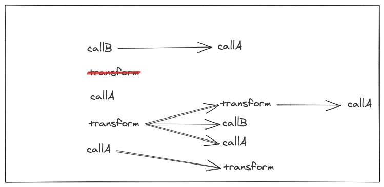
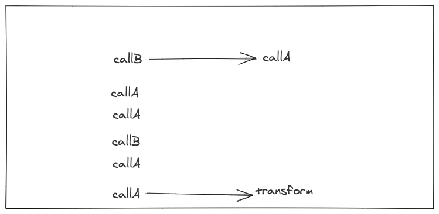
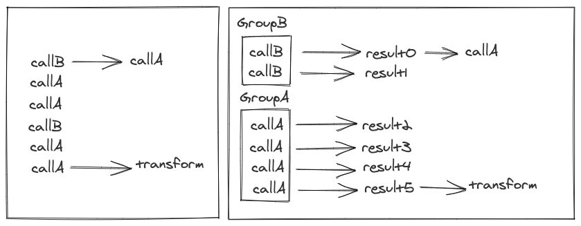

.. _query-execution:

Query Execution
###############

Stitch is essentially a Directed Acylic Graph (DAG) which is repeatedly simplified until a result is ready.
In other words, a Stitch is a series of synchronous transformations and asynchronous
calls to backends that are chained together. The graph of operations is repeatedly
simplified by performing all the synchronous transformations it can, removing operations
as they are performed. Once no more synchronous operations can be performed,
the available asynchronous calls are performed and the process repeats.
When a part of the graph is simplified then the graph that's downstream of
that point moves up a level. This means that Stitch isn't ever analyzing the whole graph,
but just the first level and repeatedly moving things to that level as their parent's are run.

In the below diagrams, think of *transform* as a simple synchronous transformation or side effect,
and think of call as meaning an asynchronous operation which requires an RPC.

These diagrams represent a Stitch query and the process of simplification

.. image:: images/DAG0.png
  :alt: Graphs showing Stitch simplification

After the first simplification the resulting computation graph would be simplified.
All the *transformations* would be applied leaving only *calls* left. This would look like this:

.. image:: images/DAG1.png
  :alt: Graphs showing Stitch simplification

Let's go step-by-step and walk through how this works.

.. image:: images/DAG2.png
  :alt: Graphs showing Stitch simplification

Looking at just the first level, the input is already evaluated so we cross it off.

.. image:: images/DAG3.png
  :alt: Graphs showing Stitch simplification

We can then shift the entire graph to the left and look at the new first level for synchronous transforms.

.. image:: images/DAG4.png
  :alt: Graphs showing Stitch simplification

Running the first one we find we can cross it off. Then we shift all its children to the left.

.. image:: images/DAG5.png
  :alt: Graphs showing Stitch simplification

With the shift to the left, we now have another transform on the first level that we can evaluate.

.. image:: images/DAG7.png
  :alt: Graphs showing Stitch simplification

We continue the process of evaluating transforms and shifting their children to the left

.. image:: images/DAG8.png
  :alt: Graphs showing Stitch simplification

.. image:: images/DAG9.png
  :alt: Graphs showing Stitch simplification

When there's no longer any transforms left on the first level 
of the graph we can move onto the next step of batching calls.

The newly simplified computation can easily gather all the calls 
together and batch them according to their backend, in this case, *A* and *B*.

The Groups are then run and another simplification takes place.

.. image:: images/DAG12.png
  :alt: Graphs showing the graph after Stitch performs RPCs

The final call operation would then be run, simplified, and the Stitch completed.

.. image:: images/DAG13.png
  :alt: Graphs showing the final steps in simplification

The above example shows a simple case of only 2 backends,
however Stitch works with any number of backends.
At each step in the simplification, all calls to each backend are grouped together.
The grouped calls are gathered until the computation can’t continue forward
until an RPC is performed. Then the calls split into batches and RPCs are performed.
With this method of batching, even widely separated calls in the graph of a Stitch
query can end up batched together if they talk to the same backend.

Looking at the above example again, but with a little modification,
what if GroupA and GroupB didn't complete their RPCs at the same time?

.. image:: images/DAGalt.png
  :alt: Graphs showing what happens if there's timing differences when a Stitch is run

In a case like this then the next simplification that occurs would run the callC that is
a child of GroupB without waiting for GroupA to finish its run.
This can have the surprising result of batching not being as optimal since the callC
after GroupA wouldn't necessarily be batched with the call after GroupB since they aren't
both ready at the same time. While this can decrease overall batch size, it generally will
benefit the performance of the Stitch since it will ensure that different parts don't end
up waiting to execute. However, if the timing is close enough, then they may still end up
batched together.

Next :ref:`running`
